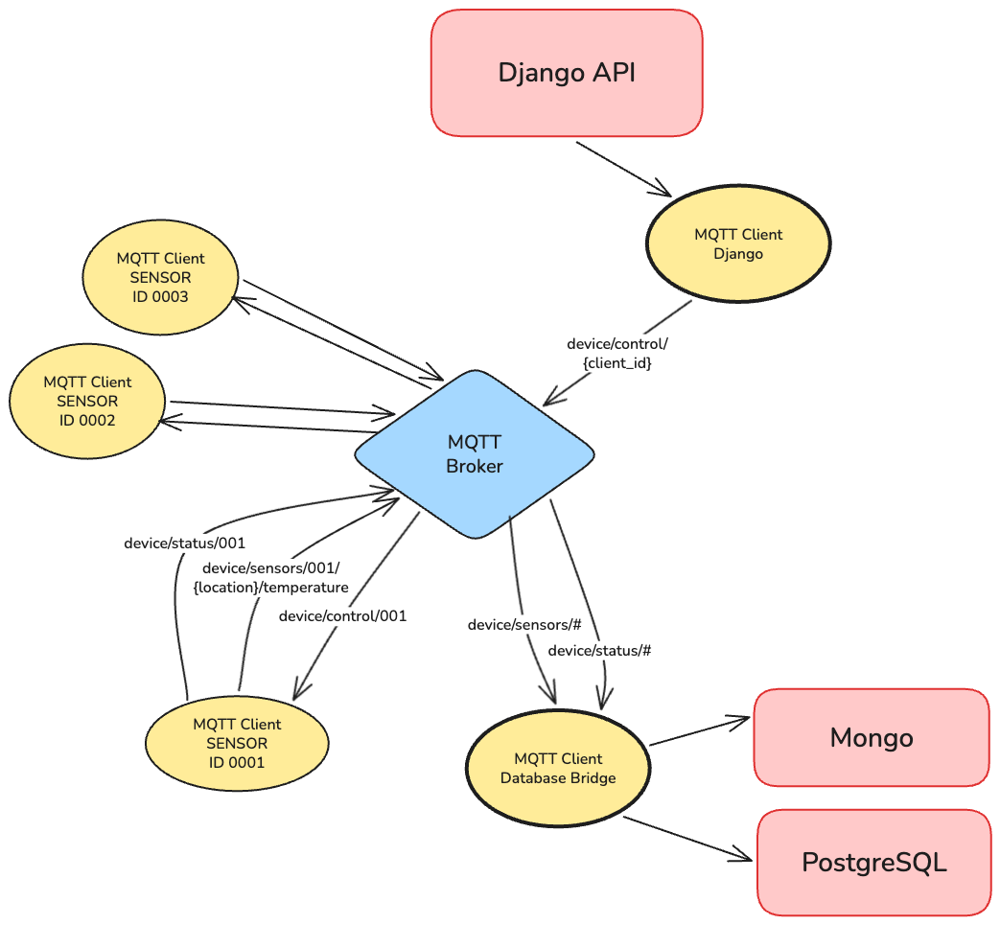

# IoT playground

### Project Structure

```
iot-playground/
├── backend/                          # Django REST API
│   ├── devices/                      # Django app for device management
│   ├── django_api/                   # Django project settings
│   ├── manage.py                     # Django management script
│
├── iot_devices/                      # IoT device implementations
│   ├── mqtt/                         # MQTT communication
│   │   ├── broker.py                 # MQTT broker implementation
│   │   ├── client.py                 # MQTT client base class
│   │   ├── client_cli.py             # CLI interface for MQTT client
│   │   ├── client_subscribe.py       # Database bridge (MQTT → PostgreSQL/MongoDB)
│   │   └── run_broker_clients.py     # Run MQTT clients with MQTT db bridge client
│   │
│   ├── modbus/                       # Modbus TCP communication
│   │   ├── modbus_server.py          # Modbus TCP server with weather data
│   │   ├── modbus_client.py          # Modbus TCP client → MongoDB
│   │   └── run_server_client.py      # Run both server and client
│   │
│   ├── db_clients/                   # Database client wrappers
│   │   └── mongo_client.py           # MongoDB client with packet storage
│   │
|   ├── run_all_devices.py            # Run MQTT broker, clients and Modbus server, client
│   └── weather_endpoint.py           # Weather API (Open-Meteo)
│
├── docker-compose.yml                # Docker orchestration
├── Dockerfile.api.yml                # Docker image for Django API
├── Dockerfile.device.yml             # Docker image for IoT devices
└── pyproject.toml                    # Python project configuration
```

### MQTT Topics Architecture



### MQTT Clients:

**Sensor client** connect with LWT (Last Will and Testament) enabled
- Automatically publish `online` status to `device/status/{CLIENT_ID}` on connect
- Publish sensor data `device/sensors/{CLIENT_ID}/{location}/temperature`
    - Temperature data from weather APIs (Open-Meteo)
    - Locations: LON (London), PRG (Prague), BRN (Brno)
- Subscribe to `device/control/{CLIENT_ID}` where we listen for shutdown event

**Database Bridge client** dumping data from sensors clients:
- subscribe to `device/sensors/#` and stores data to **MongoDB** (iot_platform collection)
- subscribe to `device/status/#` and stores data to **PostgreSQL** (MQTTClientStatus model)

**Django client**:
- publish data to `device/control/{CLIENT_ID}` with `shutdown` msg for client we want to kill

---

### Setup & Run
you can choose between running inside docker or install all app dependencies localy

**Docker:**
```bash
docker-compose build --no-cache
docker-compose up
```

attach shell to container for debugging purpose
```bash
docker run -it -p 8000:8000 iot-playground-web bash
docker run -it iot-playground-devices bash
```

**MacOS:**
```bash
brew install mosquitto

# install db
brew install postgresql
brew services start postgresql

# install mongo
brew tap mongodb/brew
brew install mongodb-community@7.0
brew services start mongodb-community@7.0

# create python virtaul env
uv sync

# run django app
uv run backend/manage.py runserver

uv run -m iot_devices.mqtt.run_broker_clients
uv run -m iot_devices.modbus.run_server_client

# or run all iot devices modbus + mqtt
uv run -m iot_devices.run_all_devices
```

### TODO
- add unit test
- add protection to modbus tcp and mqtt communication
- to get client status maybe would be better to use broker-specific topics `$SYS/broker/connection/+/state`
- use own postgre db connector in MQTTDatabaseBridge class, now it's using django postgres models